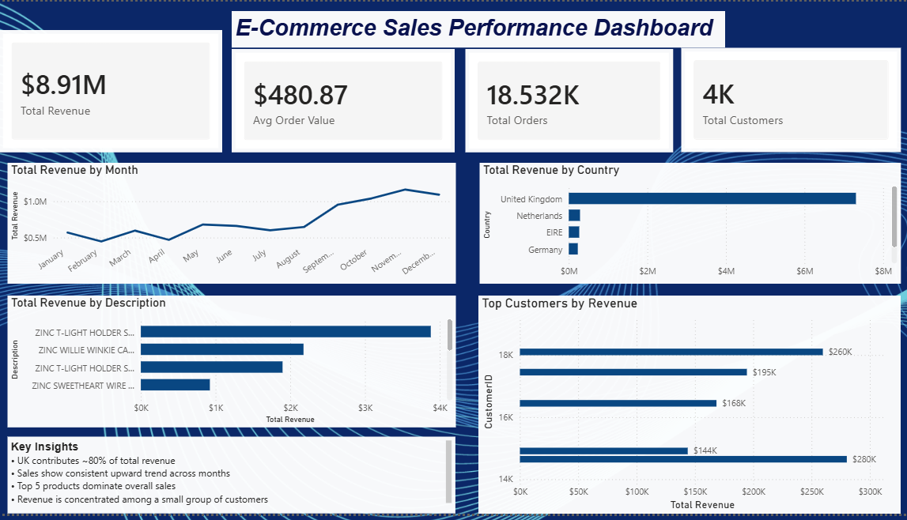
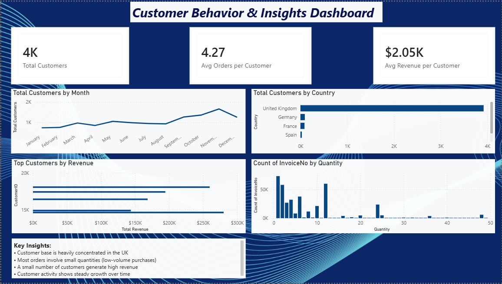
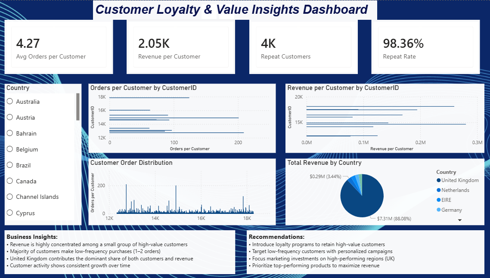

# 📊 E-commerce Sales & Customer Insights Dashboard

## 🔍 Overview

This project presents an interactive Power BI dashboard analyzing e-commerce sales data, customer behavior, and revenue trends.

---

## 📌 Key Features

* Sales performance analysis (Revenue, Orders, AOV)
* Customer behavior insights (repeat customers, order patterns)
* Top products and high-value customers identification
* Region-wise revenue distribution

---

## 📊 Dashboard Pages

### 1️⃣ Sales Overview

* Total Revenue, Orders, Customers
* Monthly sales trends
* Top products and regions

### 2️⃣ Customer Behavior

* Customer distribution and purchase patterns
* Order frequency analysis

### 3️⃣ Customer Loyalty & Value Insights

* Repeat customer analysis
* Revenue per customer
* Customer segmentation insights

---

## 📁 Files Included

- **Ecommerce_Dashboard.pbix** — Power BI dashboard file  
- **online_retail.csv** — Dataset used  
- **page1.png, page2.png, page3.png** — Dashboard preview screenshots
- **Project Report**  

---

## 🧠 Key Insights

* Revenue is concentrated among a small group of customers
* Majority of customers make low-frequency purchases
* UK dominates overall revenue contribution

---

## 🚀 Tools Used

* Power BI
* DAX (Data Analysis Expressions)
* Data Cleaning & Transformation

---

## 📷 Dashboard Preview

---

## 👤 Author

Satakshi Srivastava

